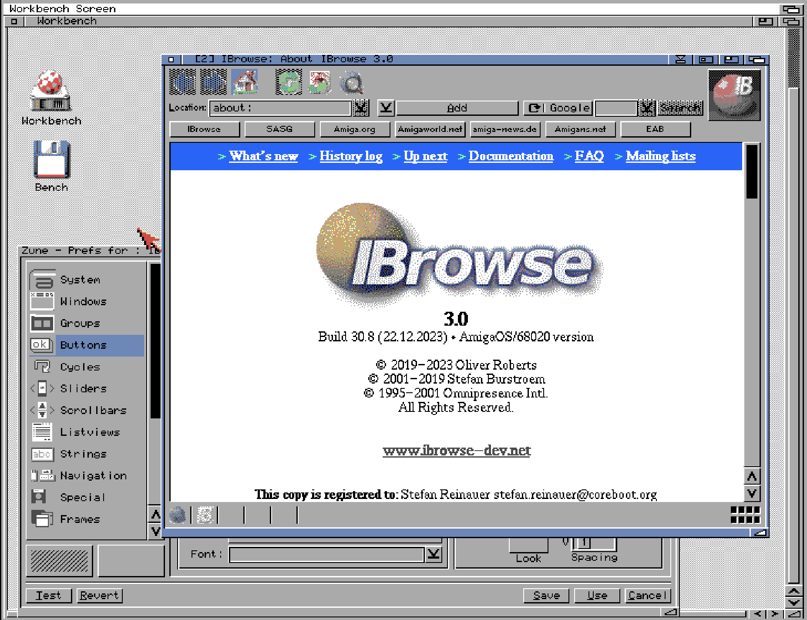

# Zune68

Zune for classic AmigaOS 3, starting from current AROS source.

The native GCC port builds both library names, Zune Prefs, 18 optional
MCC/MCP plugins, Rawimage/Pixmap image classes, catalogs, SDK headers,
examples and an Installer package.
It uses library version 19.81 from the source baseline and remains an alpha.

The native runtime supplies register gates, explicit resource ownership,
safe class and notification lifetimes, classic application services, and
planar rendering. Sorting and clipping avoid unnecessary work on m68k.
Normal builds omit trace output; diagnostics are enabled with `TRACE=1`.

With m68k-amigaos-gcc, GNU make, sfdc, fd2sfd, FlexCat and lha installed:

```sh
git submodule update --init --recursive
make -j4 all
make check
make release
```

Checks require Python with `amitools` and `machine68k`. They execute linked
68000 code with modelled OS calls. They do not establish GUI compatibility
or speed on Amiga hardware. `dist/Compatibility` describes guest workloads.
The release archive is under `build/muimaster/release`; packaged binaries
are stripped while local build outputs keep their symbols.

## Tested applications

These MUI applications have been run with Zune68 on AmigaOS 3:

- IBrowse 3.0 (build 30.8, AmigaOS/68020 version)



## CI and releases

GitHub Actions builds and checks branch pushes and pull requests. A version
tag such as `v19.81` creates a draft alpha release with an LHA and Aminet
readme. Publishing the release uploads those same assets to Aminet as
`Zune68.lha` and `Zune68.readme`. Local preparation without uploading:

```sh
python3 tools/prepare_aminet.py --tag v19.81
```

## Branches

- `aros-upstream` contains the filtered AROS history. Component source,
  directory layout, authorship, and dates are retained. Commit messages
  include an `AROS-Commit` trailer identifying the original commit.
- `main` contains Zune68 work on top of that baseline. The native
  build supports GCC; inherited SAS/C files are historical source,
  not a commitment to maintain a SAS/C build.

The source revision is
`b01e5dbafee017684634e78d15e12668fff96829` (6 October 2026).
The last retained component change is from 5 October 2026. Unrelated AROS
commits are pruned, so the filtered tip represents the selected tree at
the source revision rather than a one-to-one copy of the AROS tip commit.

## Included source

The baseline includes muimaster, muiscreen, Zune Prefs, all classes under
`workbench/classes/zune`, demos, developer tests, supporting MUI interface
files, and license/credit files. Historical paths retain the earlier test
and demo locations and the Calendar/Clock sources from Time Prefs.

BetterString, HotkeyString, the NList family, and TextEditor are included
with their preferences modules, headers, documentation, and examples.
Other AROS classes are preserved as source; the native build selects
the classic components listed above. Their history here is the history
recorded in AROS, not a reconstruction of their separate upstream repos.

The five translation repositories remain pinned submodules. TheBar is an
additional submodule pinned to its 26.22 release. Its native build includes
TheBar, TheBarVirt, TheButton, the preferences module and Toolbar wrapper,
along with catalogs, SDK headers and a runnable example. After cloning:

```sh
git submodule update --init --recursive
```

On `aros-upstream`, the top-level `.gitmodules` is filtered to the selected
translation components; all other selected file contents and modes match
the original upstream revision.
Original license and copyright notices remain in place; see `LICENSE`,
`LEGAL`, and the component-specific license files.

## Reproducing the upstream branch

Use a complete AROS clone. The importer reads it without modifying it and
requires a new output directory. It fetches independent Git objects rather
than sharing object storage with the source repository.

```sh
python3 -m venv /tmp/zune68-filter-env
/tmp/zune68-filter-env/bin/pip install git-filter-repo==2.47.0
/tmp/zune68-filter-env/bin/python tools/upstream/import-aros.py \
    --source "$HOME/git/AROS" \
    --revision b01e5dbafee017684634e78d15e12668fff96829 \
    --output /tmp/zune68-upstream-import
```

`tools/upstream/paths.txt` specifies the extraction scope.
`filter_submodules.py` scopes translation metadata. The importer preserves
original identities, dates, message encodings, and hash references while
adding original-commit trailers. It checks the resulting tree against the
selected upstream paths and writes its report to `.git/filter-repo/`.

`tools/upstream/source.json` records the current baseline and recipe hashes.
`tools/upstream/commit-map` maps retained original commits to filtered
commits. The full extraction map, including pruned commits, also lives
locally in `.git/filter-repo/commit-map`; Git does not publish that directory.

## Importing later AROS updates

Run the same importer into a new temporary directory with a newer pinned
AROS revision. Keep the path list, filter version, and callbacks stable:
changing the recipe may rewrite earlier filtered history.

While on `main`, fetch the new filtered branch without a force flag:

```sh
git fetch /tmp/zune68-upstream-import \
    aros-upstream:aros-upstream
git merge aros-upstream
git submodule update --init --recursive
```

The fetch should fast-forward `aros-upstream`. If it does not, investigate
the source ancestry and extraction recipe before proceeding. Resolve native
port conflicts on `main`, preserving the imported branch. Update the
tracked provenance report and retained commit map in the same integration.

Do not fetch the unfiltered AROS branch directly into `aros-upstream`.
